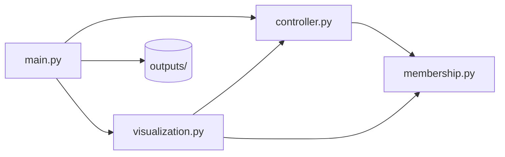
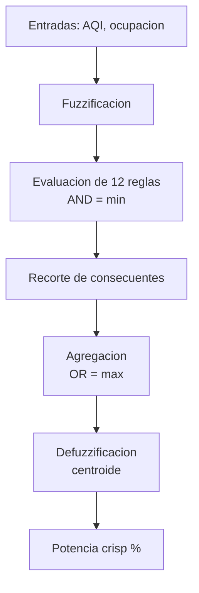

# Control difuso para purificador de aire

Documentacion tecnica del sistema implementado en `src/sistemas_difusos/`. Complementa el reporte del proyecto con la arquitectura del codigo, el flujo de inferencia y los artefactos generados.

## Proposito

El sistema reemplaza un control por umbral fijo (encendido/apagado) por un controlador Mamdani que ajusta de forma continua la potencia del purificador segun:

- **AQI** (calidad del aire): universo `[0, 200]`
- **Ocupacion** (% del espacio): universo `[0, 100]`

La salida es la **potencia del purificador** en porcentaje, con universo `[0, 100]`.

## Arquitectura del codigo



| Modulo | Responsabilidad |
|--------|-----------------|
| `membership.py` | Funciones triangular y trapezoidal; defuzzificacion por centroide |
| `controller.py` | Clase `FuzzyAirPurifierController`, reglas difusas e inferencia Mamdani |
| `visualization.py` | Graficas, superficie de control y tabla de validacion (`VALIDATION_CASES`) |
| `main.py` | Punto de entrada; orquesta la simulacion y escribe resultados en `outputs/` |

## Modelo difuso

### Entradas y salida

Los parametros de membresia estan definidos en `FuzzyAirPurifierController`:

**AQI**

| Conjunto | Tipo | Parametros |
|----------|------|------------|
| bueno | trapezoidal | (0, 0, 40, 70) |
| moderado | triangular | (55, 85, 115) |
| malo | triangular | (100, 130, 160) |
| critico | trapezoidal | (145, 170, 200, 200) |

**Ocupacion**

| Conjunto | Tipo | Parametros |
|----------|------|------------|
| baja | trapezoidal | (0, 0, 20, 40) |
| media | triangular | (30, 50, 70) |
| alta | trapezoidal | (60, 80, 100, 100) |

**Potencia**

| Conjunto | Tipo | Parametros |
|----------|------|------------|
| muy_baja | trapezoidal | (0, 0, 10, 20) |
| baja | triangular | (15, 28, 40) |
| media | triangular | (35, 50, 65) |
| alta | triangular | (60, 75, 88) |
| muy_alta | trapezoidal | (82, 92, 100, 100) |

### Base de reglas

El metodo `infer()` evalua **12 reglas** (4 niveles de AQI x 3 niveles de ocupacion) mediante el diccionario `rule_map`:

| AQI \\ Ocupacion | baja | media | alta |
|------------------|------|-------|------|
| bueno | muy_baja | baja | media |
| moderado | baja | media | alta |
| malo | media | alta | muy_alta |
| critico | alta | muy_alta | muy_alta |

### Flujo de inferencia



Detalle implementado en `controller.infer()`:

1. Calcula grados de membresia de AQI y ocupacion.
2. Para cada combinacion de etiquetas, activa la regla con `min(aqi_mu, occ_mu)`.
3. Agrupa activaciones por etiqueta de salida y toma el maximo de cada grupo.
4. Recorta los conjuntos de salida con ese grado y los agrega con maximo.
5. Obtiene la potencia final con `centroid(power_u, aggregated)`.

### Control de referencia (umbral)

`crisp_baseline()` modela un control clasico para comparacion:

- AQI `< 90` → potencia `0%`
- AQI `>= 90` → potencia `85%`

Este baseline no considera ocupacion; solo sirve como contraste frente al enfoque difuso.

## Ejecucion y salidas

```bash
sistemas-difusos
# o
python -m sistemas_difusos.main
```

`main()` crea el directorio `outputs/` (relativo al directorio de trabajo) y genera:

| Archivo | Contenido |
|---------|-----------|
| `pf_membresias_entradas.png` | Membresias de AQI y ocupacion |
| `pf_membresias_salida.png` | Membresias de potencia |
| `pf_superficie_control.png` | Superficie 3D potencia(AQI, ocupacion) |
| `pf_comparacion_umbral_vs_difuso.png` | Difuso vs umbral (ocupacion fija 50%) |
| `pf_validacion.txt` | Tabla numerica de escenarios |

## Validacion

La constante `VALIDATION_CASES` en `visualization.py` define **23 escenarios** agrupados en:

1. **Extremos del universo** (AQI 0/200, ocupacion 0/100%)
2. **Frontera del umbral crisp** (AQI 89, 90, 95 con ocupacion 50%)
3. **12 combinaciones de reglas** (centros representativos de cada nivel AQI x ocupacion)
4. **Zonas de transicion** entre conjuntos difusos (AQI 70, 115, 145)
5. **Escenarios operativos** del reporte original

### Resultados clave

| AQI | Ocupacion (%) | Umbral (%) | Difuso (%) | Observacion |
|-----|---------------|------------|------------|-------------|
| 89 | 50 | 0.0 | 50.00 | El umbral mantiene el equipo apagado; el difuso responde de forma intermedia |
| 90 | 50 | 85.0 | 50.00 | Salto abrupto del control clasico frente a transicion suave del difuso |
| 80 | 30 | 0.0 | 27.61 | Condicion moderada con respuesta gradual |
| 120 | 70 | 85.0 | 92.23 | Alta contaminacion y ocupacion elevan la potencia difusa |
| 170 | 85 | 85.0 | 93.23 | Escenario critico con potencia casi maxima |

La tabla completa se regenera en cada ejecucion en `outputs/pf_validacion.txt`.

## Conclusiones tecnicas

1. El codigo implementa Mamdani de forma explicita, sin librerias difusas externas; solo `numpy` y `matplotlib`.
2. La superficie de control confirma coherencia: mayor AQI y mayor ocupacion incrementan la potencia de forma continua.
3. La validacion ampliada (23 escenarios) cubre extremos, reglas individuales y zonas de solapamiento entre conjuntos.
4. La separacion en modulos facilita ajustar membresias (`controller.py`), reglas o escenarios de prueba (`visualization.py`) de manera independiente.

## Referencias

1. L. A. Zadeh, "Fuzzy Sets," *Information and Control*, vol. 8, no. 3, pp. 338-353, 1965.
2. T. J. Ross, *Fuzzy Logic with Engineering Applications*, 3rd ed., Wiley, 2010.
3. K. M. Passino and S. Yurkovich, *Fuzzy Control*, Addison-Wesley, 1998.
